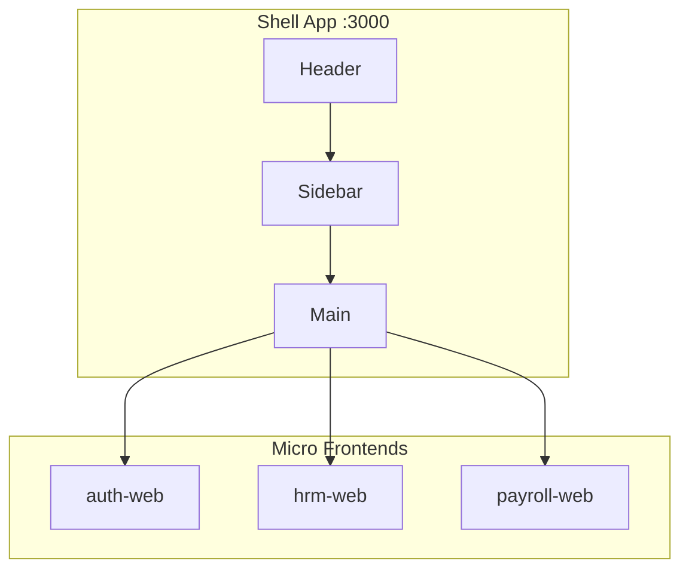

# Phase 18: 완료 보고서 작성

> **⚠️ 시작 전 필독**: [CODING_GUIDELINES.md](./CODING_GUIDELINES.md)

---

## 📌 목표

초급 개발자가 시스템을 이해할 수 있는 완료 보고서를 작성합니다.

---

## ✅ 작성 항목

### 18.1 아키텍처 다이어그램



### 18.2 서비스별 설명

| 서비스 | 포트 | 역할 | 주요 API |
|--------|------|------|----------|
| shell | 3000 | 컨테이너 | - |
| auth-web | 3001 | 인증 | `/api/auth/*` |
| hrm-web | 3010 | 인사 | `/api/hrm/*` |
| ... | ... | ... | ... |

### 18.3 구현 완료 항목

**스크린샷 포함**:
- 로그인 화면
- 대시보드
- 사이드바 토글
- AI 어시스턴트
- DataGrid (10만 건)

### 18.4 테스트 결과

| 항목 | 결과 |
|------|------|
| 테스트 커버리지 | 85% |
| Lighthouse Accessibility | 98점 |
| WAVE 오류 | 0건 |
| E2E 테스트 | 15/15 통과 |

### 18.5 배포 가이드

```bash
# 전체 서비스 실행
docker-compose up

# 개별 서비스
docker run -p 3010:3010 erp/hrm-web:latest
```

### 18.6 전문 용어 사전

| 용어 | 설명 |
|------|------|
| Micro Frontend | 독립 배포 가능한 프론트엔드 앱 |
| Shell App | 서비스들을 통합하는 컨테이너 |
| WCAG | 웹 접근성 국제 표준 |
| 2FA | 2단계 인증 |

---

## 📊 완료 체크리스트

- [ ] 아키텍처 다이어그램 작성
- [ ] 모든 서비스 설명
- [ ] 스크린샷 첨부
- [ ] 테스트 결과 기록
- [ ] 배포 가이드 작성
- [ ] 전문 용어 사전

---

## 🎉 프로젝트 완료!

모든 Phase가 완료되었습니다.

**최종 산출물**:
- 17개 마이크로서비스 Docker 이미지
- @erp/ui 디자인 시스템
- Storybook 컴포넌트 카탈로그
- 자동화 테스트 스위트
- 완료 보고서
