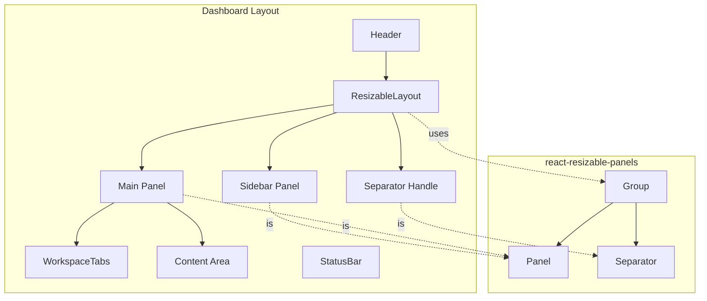

# Phase 20: 리사이저블 패널 - 완료 보고서

> **작성일**: 2025-12-20  
> **Task 파일**: [task_phase_20_resizable_panels.md](./task_phase_20_resizable_panels.md)  
> **상태**: ✅ 완료

---

## 📌 구현 요약

VS Code 스타일의 리사이저블 패널 레이아웃을 구현했습니다. 사이드바와 메인 콘텐츠 사이의 경계를 드래그하여 크기를 조정할 수 있습니다.

### 구현된 기능
- ✅ 사이드바 너비 드래그로 조정
- ✅ 패널 크기 localStorage에 자동 저장/복원
- ✅ 최소/최대 크기 제한 (10% ~ 30%)
- ✅ 사이드바 접기/펼치기
- ✅ 키보드 접근성 지원

---

## 🏗️ 아키텍처



### 컴포넌트 구조

| 파일 | 역할 |
|------|------|
| [`resizable-layout.tsx`](file:///data/erp-frontend/apps/shell/components/layout/resizable-layout.tsx) | 리사이저블 레이아웃 컴포넌트 |
| [`layout.tsx`](file:///data/erp-frontend/apps/shell/app/(dashboard)/layout.tsx) | 대시보드 레이아웃 통합 |
| [`globals.css`](file:///data/erp-frontend/apps/shell/app/globals.css) | 핸들 스타일 정의 |

---

## 📂 수정된 파일

### 신규 생성
| 파일 | 설명 |
|------|------|
| `components/layout/resizable-layout.tsx` | 리사이저블 레이아웃 컴포넌트 |
| `stories/layout/ResizableLayout.stories.tsx` | Storybook 스토리 (3가지 변형) |

### 수정
| 파일 | 변경 내용 |
|------|-----------|
| `app/(dashboard)/layout.tsx` | ResizableLayout 적용 |
| `app/globals.css` | 핸들 스타일 추가 |
| `package.json` | react-resizable-panels 의존성 |

---

## 🧪 테스트 방법

```bash
# 1. 개발 서버 실행
pnpm --filter shell dev

# 2. 브라우저에서 http://localhost:3000 접속

# 3. 로그인 후 대시보드에서 테스트:
#    - 사이드바와 메인 영역 사이의 경계를 드래그
#    - 크기가 조정되는지 확인
#    - 새로고침 후에도 크기가 유지되는지 확인

# 4. Storybook에서 확인
pnpm --filter shell storybook
# 브라우저에서 http://localhost:6006 접속
# Layout > ResizableLayout 스토리 확인
```

### Storybook 스토리
- **Default**: 기본 리사이저블 레이아웃
- **NarrowSidebar**: 좁은 사이드바 예시
- **WideSidebar**: 넓은 사이드바 (파일 탐색기 스타일)

---

## ⚙️ 기술 세부사항

### 사용 라이브러리
- `react-resizable-panels@4.0.11`

### 주요 API (v4)
```tsx
import { Group, Panel, Separator, usePanelRef, type PanelSize } from 'react-resizable-panels';

// Group: 패널 그룹 (PanelGroup 대신 v4에서는 Group 사용)
// Panel: 개별 패널
// Separator: 리사이즈 핸들 (PanelResizeHandle 대신 v4에서는 Separator 사용)
// usePanelRef: 패널 프로그래밍적 제어용 훅
// PanelSize: 패널 크기 타입 (숫자 또는 문자열)
```

### v4 API 변경사항
- `PanelGroup` → `Group`
- `PanelResizeHandle` → `Separator`
- `autoSaveId` → `id`
- `direction` → `orientation`
- `onResize(size: number)` → `onResize(panelSize: PanelSize, id?)`

---

## 🔮 향후 개선 제안

1. **세로 방향 리사이저블 패널**: 하단 터미널/출력 패널 추가
2. **패널 그룹 분할**: 메인 영역 내 에디터 분할 기능
3. **프리셋 레이아웃**: 사용자 정의 레이아웃 저장/불러오기
4. **드래그 피드백**: 리사이즈 중 크기 표시 툴팁

---

## ➡️ 다음 단계

[Phase 21: 탭 시스템](./task_phase_21_tab_system.md)으로 진행하세요.
